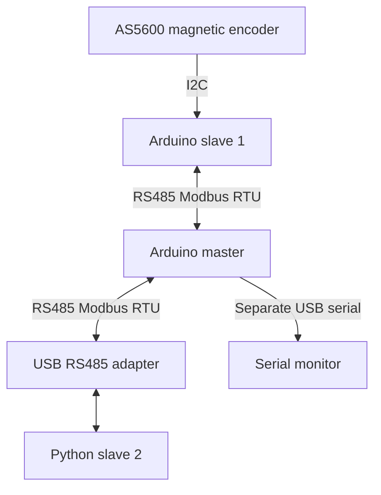

# Modbus–AS5600 Robotics Lab

**A source-backed experiment in encoder acquisition and a multi-node RS485 bus.**

An Arduino master polls an AS5600 encoder node and a Python laptop node using Modbus RTU. The repository captures wiring, register responsibilities and the trade-offs of sharing serial resources on small microcontrollers.

**Status:** firmware examples and technical notes. Hardware performance measurements and a pinned Arduino build environment are pending. CAN, ESP32, RTOS and odometry integration are future work, not implemented capabilities of this repository.

## System architecture



[Wiring and pins](hardware/pin_mapping.md) · [Full wiring notes](hardware/wiring_master_slave_laptop.md) · [Register and timing contract](docs/PROTOCOL.md) · [Measurement protocol](docs/MEASUREMENT_PROTOCOL.md)

## What the source demonstrates

| Component | Responsibility | Entry point |
| --- | --- | --- |
| Encoder node, ID 1 | Read angle over I2C; expose angle, heartbeat and read status | `arduino/06_slave1_as5600_hardware_serial/` |
| Arduino master | Alternate FC03 requests to slave 1 and slave 2 | `arduino/07_master_read_slave1_and_laptop/` |
| Laptop node, ID 2 | Expose four changing values and a heartbeat | `python/02_laptop_modbus_slave/` |
| Earlier examples | Register writes, direct sensor reads and configuration | `arduino/01_*` through `arduino/05_*` |

The latest example configures **9600 baud, 8N1**, encoder acquisition every **50 ms**, a master request cycle threshold of **500 ms**, and a **300 ms** master timeout. These are settings found in code, not measured latency, throughput or a tested-node limit.

## Run and inspect

For the laptop example, use Python 3.12 and the compatible legacy PyModbus API:

```bash
python -m venv .venv
# Use .venv\Scripts\python.exe on Windows.
.venv/bin/python -m pip install -r python/requirements.txt
.venv/bin/python python/02_laptop_modbus_slave/laptop_slave_array_sender.py --help
.venv/bin/python python/02_laptop_modbus_slave/laptop_slave_array_sender.py --port COM23
```

On Linux select the actual serial device, for example `/dev/ttyUSB0`. Do not assume the example port exists. The script opens hardware only under its `main` entry point and keeps values within unsigned 16-bit registers.

For firmware, open the relevant `.ino` in the Arduino IDE. The code targets the UNO/Nano-style pins in the wiring document and depends on `Wire`, `SoftwareSerial`, and a compatible `ModbusRtu.h` library. The precise third-party library revision and board core have not been recovered, so no compile-success badge is claimed.

## Evidence and limitations

- Register layout and task timing are traceable to the checked-in source.
- AS5600 status means the I2C transaction produced a reading; it does **not** prove valid magnet strength or placement.
- A failed encoder read retains the previous angle. Consumers must check status and heartbeat before using it.
- `COM_IDLE` alone does not establish a successful Modbus response; the master currently prints the buffer without explicit freshness/error gating.
- The source has two slave IDs. Maximum reliable node count, latency percentiles, packet loss and sustained polling rate are **measurement pending**.
- This is a communication experiment, not a motor safety controller. See the [CAN and robot integration plan](docs/ROBOT_INTEGRATION.md).

## Verification

```bash
python -m pip install -r python/requirements.txt
python -m unittest discover -s tests -v
python -m compileall -q python
```

These host checks validate register rollover, import behavior and syntax. They do not transmit on RS485 or substitute for firmware compilation and hardware tests. See [verification](docs/VERIFICATION.md).

The existing Indonesian notes in `docs/01_*` through `docs/09_*` remain available as the detailed learning record. MIT license retained unchanged. Photos and bench traces are listed in [asset requests](ASSET_REQUESTS.md).
